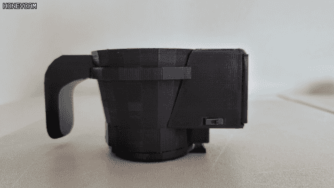

# Code assembled for Sugar1Cup (Graduation Project - Electronic Engineering)

## File Guide
### android_app
- android app file (java)
- save data for json in app & visualization to graphs (pie / bar)
- save personal data (user input) to calculate kilocalories & recommended sugar

### arduino
- hardware code (arduino / c / cpp)
- uploaded to ATTiny1614 Microcontroller (with [jtag2updi by ElTangas](https://github.com/ElTangas/jtag2updi) + [megaTinyCore by SpenceKonde](https://github.com/SpenceKonde/megaTinyCore))
- saves sensor output (RGB data + IR data + GyroSensor data) in binary buffer and send it by bluetooth connection (HC-06)

### matlab
- matlab code (.m)
- it is generated for plotting binary RGB data to 3-axis scatter graph
- (used for data qualification & visualizing for presentation)

### python
#### binwatchtest
- this file is the main file used for this project (PC Server)
- it watches certain folder for whether new file is generated (sent by android app) or not
- if new file detected, **binkeras_load** or **binkeras** function called
#### binkeras
- this file is called when new file's name is <beverage_name_here>.bin (ex: coke.bin)
- train all the data inside the folder (except temp.bin)
- if there's coke_1.bin and coke_2.bin, those data is both trained as label 'coke' (for multiple data in each beverage label)
- and save keras model data + weight in the folder (for further usage!)
#### binkeras_load
- this file is called when new file's name is temp.bin
- it classifies the beverage name by binary data in temp.bin (sensor output obtained by hardware, RGB + IR)
- saved model data + weight is loaded
#### binread & binwatch
- py files for test (prototype - not for actual usage)

## Stages
- [x] 0715 Meeting
    - housing design
    - keras organization
    - export converted data to csv (Excel) file
- [x] 0729 Meeting
    - organize data
    - create 3-axis graph for RGB (Matlab)
    - create 3-axis graph for Gyro (Matlab)
    - housing design
    - Compare RGB data under different light condition
- [x] 0812 Meeting
    - add IR sensor for sugar measure
    - (effective detection for those who has similar color)
    - add multiplexer for more pins (RGB LED, IR sensor, etc)
- [x] 0826 Meeting
    - Test IR LED (InGaAs 1450nm LED & Si 950nm LED) and Photodiode
    - for similar color beverage
    - Investigate Android - PC server (Keras) - Sensor connection
- [x] 0909 Meeting
- [x] 0923 Meeting
    - Test IR sensor on similar color beverage
- [x] 1005 Meeting
    - Start hardware soldering
    - Start Android App programming
    - refine 3D modeling design
    - Start collecting train values
